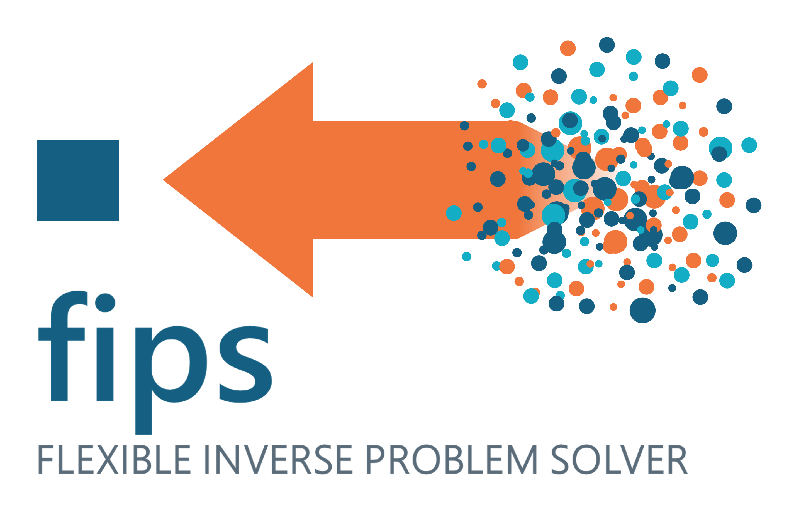
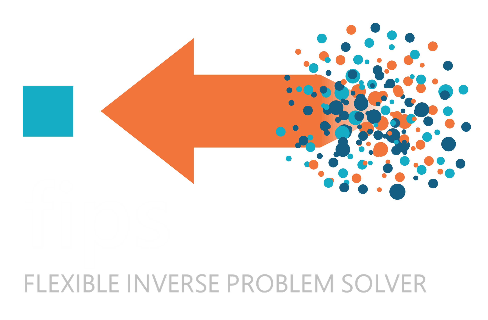

.. rst-class:: hidden-title
==============
fips |release|
==============

.. include:: ../README.md
   :parser: myst_parser.sphinx_
   :start-line: 16
   :end-before: ## Documentation

.. toctree::
   :maxdepth: 1
   :hidden:

   installation
   getting_started
   usage
   examples/index
   reference/index

----

* `Contributing Guide <https://github.com/jmineau/fips/blob/main/CONTRIBUTING.md>`_
* :ref:`modindex`
* :ref:`search`
